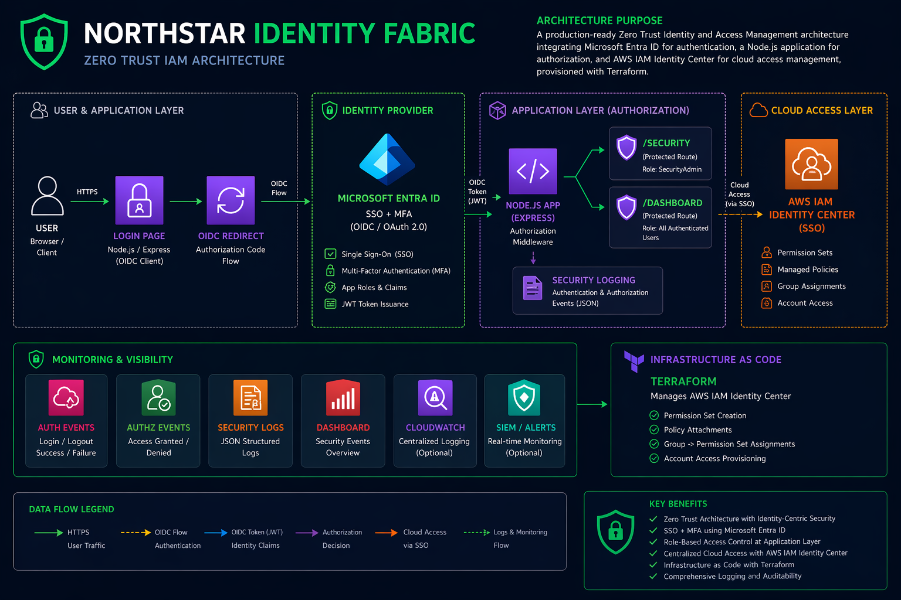
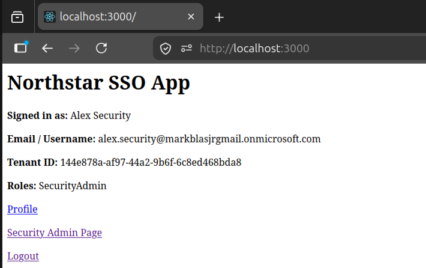
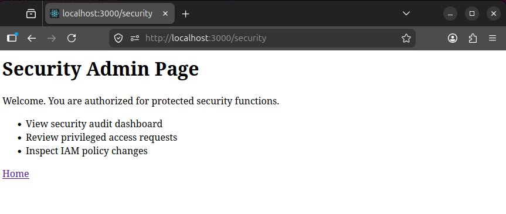
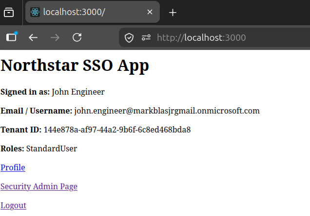
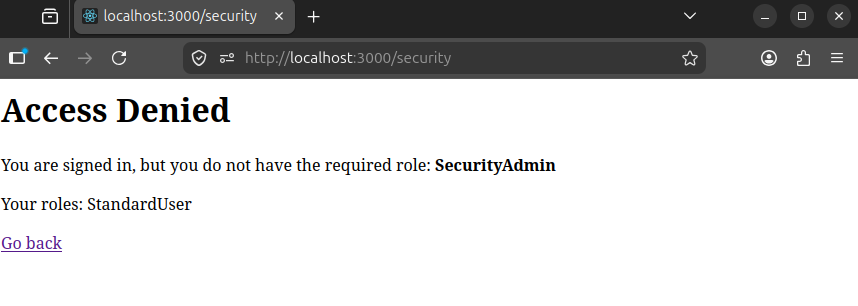
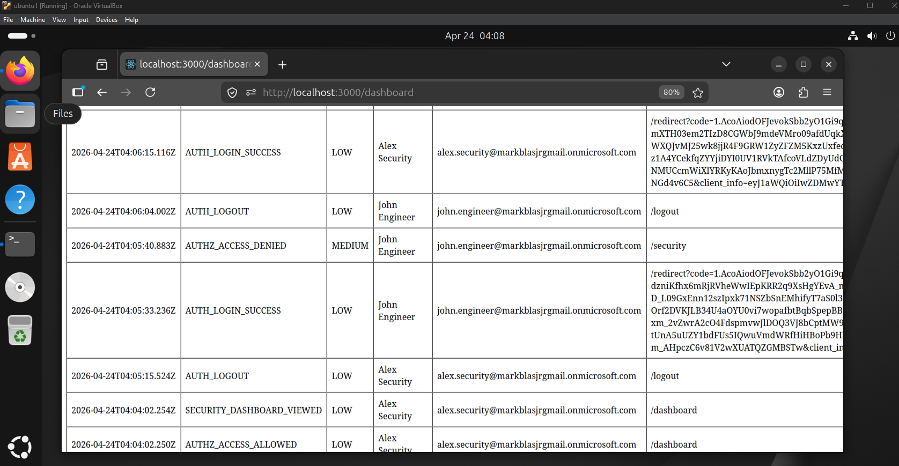
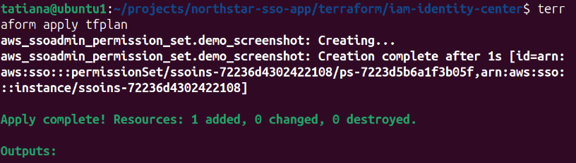
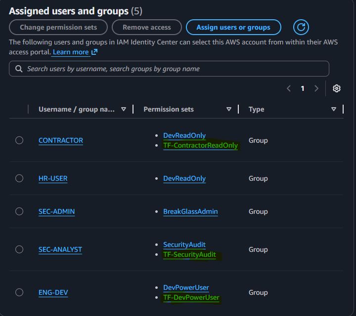

# Northstar Identity Fabric
Zero Trust IAM Architecture (SSO • MFA • OIDC • RBAC • Terraform)

## What This Is
Northstar Identity Fabric is a production-style Identity and Access Management (IAM) system that demonstrates how modern enterprises implement Zero Trust security.

This project separates authentication, authorization, and cloud access using:

* Microsoft Entra ID for SSO and MFA
* Node.js application for authorization enforcement
* AWS IAM Identity Center for cloud RBAC
* Terraform for infrastructure as code

---

## Architecture

NOTE: SIEM / Alerts: Future integration point for forwarding structured security logs to CloudWatch, Microsoft Sentinel, or OpenSearch for alerting and incident detection.

## Why It Matters

* Implements Zero Trust security principles
* Demonstrates real SSO authentication using OIDC
* Enforces authorization at the application layer
* Uses AWS IAM Identity Center for scalable access control
* Uses Terraform to manage IAM as code

---

## Core Capabilities

* Single Sign-On (SSO) with MFA
* Role-Based Access Control (RBAC)
* Protected application routes (/security, /dashboard)
* Access denied enforcement for unauthorized users
* Structured security event logging
* Terraform-managed AWS IAM permission sets
* Least privilege access model

---

## Demo Scenarios

### Admin Access (Allowed)
* User: alex.security
* Route: /security
* Result: Access Granted

### Unauthorized Access (Denied)
* User: john.engineer
* Route: /security
* Result: Access Denied

### Security Dashboard
* Route: /dashboard
* Displays authentication and authorization events

### Example Security Event

{
* "timestamp": "2026-04-23T12:00:00Z",
* "eventType": "AUTHZ_ACCESS_DENIED",
* "severity": "MEDIUM",
* "user": "John Engineer",
* "route": "/security",
* "requiredRole": "SecurityAdmin",
* "decision": "Denied"
}

# How to Run

### Install dependencies
* npm install
### Create .env file
* nano .env\
CLIENT_ID=your-client-id\
CLIENT_SECRET=your-client-secret\
TENANT_ID=your-tenant-id\
REDIRECT_URI=http://localhost:3000/redirect \
SESSION_SECRET=your-random-secret

## Start the app
node app.js
## Open browser
http://localhost:3000

## Terraform Usage

* cd terraform/iam-identity-center
* terraform init
* terraform plan -out=tfplan
* terraform apply tfplan
  

## Terraform manages:

* Permission sets
* Policy attachments
* Group to permission set assignments
  ### Terraform applied permission sets to AWS
  
  
## Design Principles

* Zero Trust Architecture
* Least Privilege Access
* Identity-Centric Security
* Separation of Authentication and Authorization
* Audit Logging and Monitoring
---

## Future Improvements

* CI/CD pipeline (GitHub Actions)
* CloudWatch or SIEM integration
* Multi-account AWS architecture
* Attribute-Based Access Control (ABAC)
